* Table of Contents
{:toc}

--------------------------------------------------------------------------------------------------------------------

## **Setting up, getting started**

Refer to the guide [_Setting up and getting started_](SettingUp.md).

--------------------------------------------------------------------------------------------------------------------

## **Introduction** 

Pawbook is a desktop application for dog school managers to facilitate their bookkeeping of puppies and dogs in the
school, optimized for input via a **Command Line Interface (CLI)** which caters to fast-typers who prefer to use a 
keyboard. You can navigate the application with ease and execute instructions by typing text-based commands in the 
command box provided without ever having to reach for your mouse!

## **Purpose** 

This document aims to serve as a guide for developers, testers and designers who are interested in working on Pawbook. 
It describes both the design and architecture of Pawbook. 

## **Target User Profile**

The target user profile are dog school managers that own and manage the daily operations of the dog schools. They
handle a wide range of operations such as keeping track of the dogs under their care, arranging programs and taking care
of the dogs on a daily basis. They need a systematic way of maintaining their handle on the operations of their school
at all times.

## **Value Proposition**

In Singapore, dog schools are popular among dog owners. Besides day care, they also provide training,
grooming and workshops. With many moving parts daily, managing operations  can get overwhelming.
PawBook is an all-in-one management system to help dog school managers to maintain organisation of their dog schools. 
Besides keeping track of all the dogs under their care, it also allows users to plan their schedule and manage programs 
and classes. At present, there is no such application to help dog school owners to organise and manage their dog school 
currently. This application serves to increase the effectiveness and efficacy of dog schools managers. 

--------------------------------------------------------------------------------------------------------------------

## **Design**

### Architecture

{: .center-image}

The ***Architecture Diagram*** given above explains the high-level design of the App. Given below is a quick overview of each component.

**`Main`** has two classes called [`Main`](https://github.com/AY2021S2-CS2103T-T10-1/tp/blob/master/src/main/java/dog/pawbook/Main.java) and [`MainApp`](https://github.com/AY2021S2-CS2103T-T10-1/tp/blob/master/src/main/java/dog/pawbook/MainApp.java). It is responsible for:
* At app launch: Initializes the components in the correct sequence, and connects them up with each other.
* At shut down: Shuts down the components and invokes cleanup methods where necessary.

[**`Commons`**](#common-classes) represents a collection of classes used by multiple other components.

The rest of the App consists of four components.

* [**`UI`**](#ui-component): The UI of the App.
* [**`Logic`**](#logic-component): The command executor.
* [**`Model`**](#model-component): Holds the data of the App in memory.
* [**`Storage`**](#storage-component): Reads data from, and writes data to, the local persistent storage.

Each of the four components,

* defines its *API* in an `interface` with the same name as the Component.
* exposes its functionality using a concrete `{Component Name}Manager` class (which implements the corresponding API `interface` mentioned in the previous point.

For example, the `Logic` component (see the class diagram given below) defines its API in the `Logic.java` interface and exposes its functionality using the `LogicManager.java` class which implements the `Logic` interface.

{: .center-image}

**How the architecture components interact with each other**

The *Sequence Diagram* below shows how the components interact with each other for the scenario where the user issues the command `delete owner 1`.

{: .center-image}

The sections below give more details of each component. 

### UI component

{: .center-image}

**API** :
[`Ui.java`](https://github.com/AY2021S2-CS2103T-T10-1/tp/blob/master/src/main/java/dog/pawbook/ui/Ui.java)

The UI consists of a `MainWindow` that is made up of parts e.g.`CommandBox`, `ResultDisplay`, `EntityListPanel`, `StatusBarFooter` etc. All these, including the `MainWindow`, inherit from the abstract `UiPart` class.

The `UI` component uses JavaFx UI framework. The layout of these UI parts are defined in matching `.fxml` files that are in the `src/main/resources/view` folder. For example, the layout of the [`MainWindow`](https://github.com/AY2021S2-CS2103T-T10-1/tp/blob/master/src/main/java/dog/pawbook/ui/MainWindow.java) is specified in [`MainWindow.fxml`](https://github.com/AY2021S2-CS2103T-T10-1/tp/blob/master/src/main/resources/view/MainWindow.fxml)

The `UI` component,

* Executes user commands using the `Logic` component.
* Listens for changes to `Model` data so that the UI can be updated with the modified data.

### Logic component

{: .center-image}

**API** :
[`Logic.java`](https://github.com/AY2021S2-CS2103T-T10-1/tp/blob/master/src/main/java/dog/pawbook/logic/Logic.java)

1. `Logic` uses the `PawbookParser` class to parse the user command.
2. This results in a `Command` object which is executed by the `LogicManager`.
3. The command execution can affect the `Model` (e.g. adding a owner).
4. The result of the command execution is encapsulated as a `CommandResult` object which is passed back to the `Ui`.
5. In addition, the `CommandResult` object can also instruct the `Ui` to perform certain actions, such as displaying help to the user.

Given below is the Sequence Diagram for interactions within the `Logic` component for the `execute("delete owner 1")` API call.

{: .center-image}

:information_source: **Note:** The lifeline for `DeleteOwnerCommandParser` should end at the destroy marker (X) but due to a limitation of PlantUML, the lifeline reaches the end of diagram.

### Model component

{: .center-image}

**API** : [`Model.java`](https://github.com/AY2021S2-CS2103T-T10-1/tp/blob/master/src/main/java/dog/pawbook/model/Model.java)

The `Model`,

* stores a `UserPref` object that represents the user’s preferences.
* stores the pawbook database data.
* exposes an unmodifiable `ObservableList<Entity>` that can be 'observed' e.g. the UI can be bound to this list so that the UI automatically updates when the data in the list change.
* does not depend on any of the other three components.

### Storage component

{: .center-image}

**API** : [`Storage.java`](https://github.com/AY2021S2-CS2103T-T10-1/tp/blob/master/src/main/java/dog/pawbook/storage/Storage.java)

The `Storage` component,
* can save `UserPref` objects in json format and read it back.
* can save the Pawbook Database data in json format and read it back.

### Common classes

Classes used by multiple components are in the `pawbook.commons` package.

--------------------------------------------------------------------------------------------------------------------

## **Implementation**

This section describes some noteworthy details on how certain features are implemented.

### Entities: Owner/Dog/Program

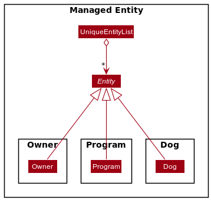{: .center-image}

Despite having three closely related entities in Pawbook, the actual implementation does not couple the 3 entities together in any ways. Instead of storing a reference between an Owner and their Dog, a symbolic ID number is used to represent these links. This ensures that data objects continue to only store information and leave the control/manipulation of data to the logic side of the application. It is therefore possible for all the various entities to remain immutable as well.

This necessitates that an unique ID number is assigned to every entity during its creation and remain constant throughout its lifetime in the application. A simple numbering system is used here whereby the ID is generated by incrementing from 1 until an unused number is found, gaps between numbers will only be filled after a restart of the application to simplify the code.

The ID system replaces the original implementation that uses the index of every Person in the visible list. This gives the advantage of being able to reference to any entity on any screen, which can be useful since different entities are not displayed together.

The `UniqueEntityList` contains pairs of ID and entity. This attempts to mimic a map/dictionary while keeping possible to continue using the original UI components with minimal changes to the code. Every entity does not store its ID as an internal attribute due to the fact that ID is dynamically generated, usually after the instantiation of the entity itself. The ability to set or change the ID during the lifetime of the entity will violate the immutability of the entities. Furthermore, there is no need for the any entity to be aware of its ID.

#### Alternative Implementation: Using a Hashmap as container for unique entities

A hashmap was briefly considered as a candidate for storing the unique entities as it was a natural fit.

Benefits:
* Much faster lookup when retrieving an entity by its ID or to check for ID clashes.

Drawbacks:
* Hashmaps have no inherent order, it will be quickly become expensive to maintain order whenever there are data changes.
* There is no `FilteredList` equivalent for maps in JavaFX, filtering cannot be simply achieve within `Model` and will need to be done on the GUI side.

This current implementation though not ideal, avoid many potential rewrites since there is no `ListView` equivalent for maps in JavaFX. Switching to using a hashmap as underlying data structure will mean that a table will need to be used to display all the entries, adding unnecessary complication to the code as filtering and sorting will no longer as be simple. Most of these changes are under-the-hood and does not improve user experience significantly.

### Adding/Deleting feature

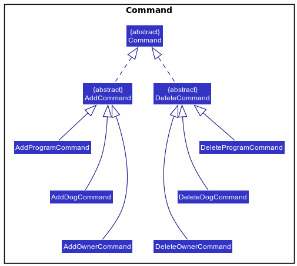{: .center-image}

Pawbook manages more than one type of entity, each with their own unique attributes. An OOP approach is used here whereby both the `AddCommand` and `DeleteCommand` are generic classes that extends the `Command` class. This way any number of other classes extending `entity` can be added/deleted as well.

Example: `add owner n/NAME p/PHONE e/EMAIL a/ADDRESS [t/TAG]...`

#### Implementation

The actual execution of the different add commands are highly similar and often differ only by the extra entity-specific checks, e.g. verifying that the owner ID refers to an actual owner instead of taking in an arbitrary number. The same applies to delete commands as well.

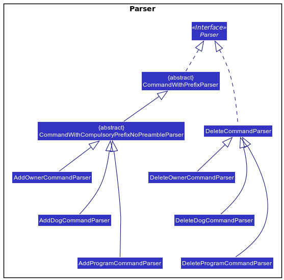{: .center-image}

In order to generate the respective commands, the raw input needs to be parsed first. It is required that the user provide a second keyword right after the `add`/`delete` command keyword to indicate the correct entity type to be added. Using this information, the arguments can be forwarded to the correct parser from within `PawbookParser` to generate the actual add/delete commands.

Given below is an example usage scenario and how the add command behaves at each step.

Step 1. The user launches the application and executes `add owner n/BRUCE p/92019201 e/bruce@example.com a/BLK 123 Adam Road t/friendly` to save an owner.

Step 2. The owner is added to the model.

Below is an example activity diagram for a valid add command from the user.

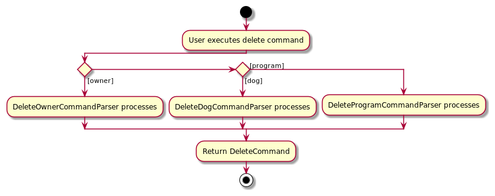{: .center-image}

The activity diagram for both add and delete commands are mirrored. Based on the name of the entity type supplied, the correct parser will be instantiated to parse the arguments and generate the executable command. 

To further illustrate how an actual deletion of an entity is performed, below is an example sequence diagram for a valid delete command from the user.

{: .center-image}

The deletion of any entity will typically affect other related entities as well, as shown in a more details sequence diagram below.

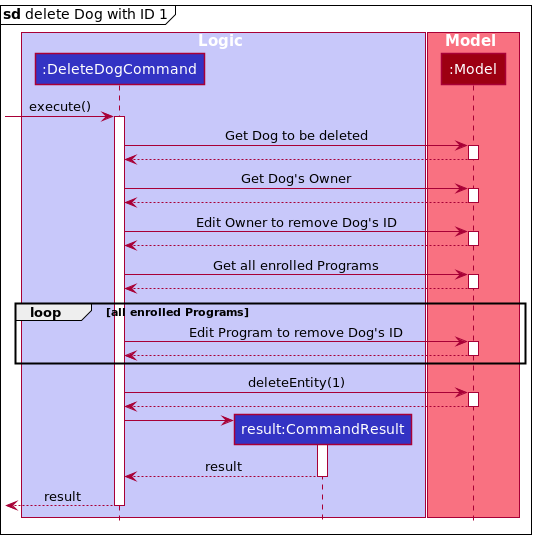{: .center-image}

This is how the `DeleteDogCommand` works upon execution:
1. The `Dog` to be deleted will first be retrieved from the `Model`.
2. Using the ID stored in the `Dog`, the `Owner` can be retrieved from `Model` as well.
3. A new `Owner` with the same details except without the current `Dog`'s ID will be created to replace the current `Owner` instance in the `Model`.
4. A list of `Program` that the `Dog` is enrolled in will be generated.
5. For each of these `Program`, it will be edited to remove the current `Dog`'s ID.
6. With no more entities referring to the current `Dog`, it is safe to call `Model#deleteEntity(...)` to delete the `Dog`.

The various add commands will similarly perform the reverse of the delete command.

### Edit feature

Pawbook allows the user to `edit` an entity. For instance, the user may want to `edit`  some features of an owner. By entering the edit command with the correct identification number of the owner to be edited, the specified features of the owner will be modified accordingly.

In order to generate the respective commands, the raw input needs to be parsed first. It is required that the user provide a second keyword right after the `edit` command keyword to indicate the correct entity type to be edited. Using this information, the arguments can be forwarded to the correct parser from within `PawbookParser` to be further processed.

Below is an example activity diagram for a valid view command from the user.

{: .center-image}

### Find feature

Pawbook allows the users to `find` an entity based on keyword searches. The `find` function entertains multiple keyword
searches and reveals the entire list of commands that match one or more of the results.

When the user enters a valid command with the keyword searches, the arguments are parsed by the `FindCommmandParser` that
converts the string of arguments into a list, that is subsequently passed on to a `NameContainsKeywordsPredicate` object
that uses the list of keywords to find the search results based on the supplied keywords. Take note that Find Command supports 
substring searching, so for example if there is an Alice in the program, searching "Ali" will also return Alice as result. 

Below is an example activity diagram for a valid find command from the user.

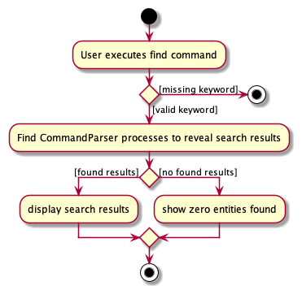{: .center-image}

Below is an example sequence diagram for a valid find command from the user.

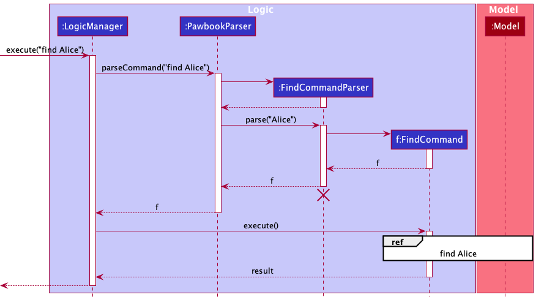{: .center-image}

1. The `LogicManager` uses the `PawbookParser` to parse the given user input.
2. The `PawbookParser` identifies the user command and creates a `FindCommandParser` object. It then calls the `FindCommandParser`'s `parse()`method with user input as the parameter.
3. In the `parse()` method, the `FindCommandParser` will then generate the `FindCommand` object. This is then returned all the way back to the `LogicManager`.
4. The `LogicManager` will then proceed to call the `execute()` method.
5. The `execute()` method is further explored below. The high level understanding is that a CommandResult is returned and finally passed back to `LogicManager`.

Here is a more specific breakdown of the command's execute method.

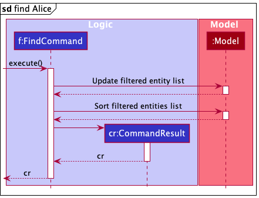 {: .center-image}

1. Upon calling the `execute()` method, the `FindCommand` updates the filtered entity list in `Model` using a `NameContainsKeywordsPredicate` as parameter. 
2. It then sorts the entity using the `sortEntities()` in increasing order by using a `COMPARATOR_ID_ASCENDING_ORDER` comparator that orders entities in increasing ID order. 
3. From here, Find Command creates a command result and returns it to the `LogicManager`.

### List Feature
Pawbook allows the users to `list` an entity based on keyword searches. The `list` function responds to the current available
entities, which are `owner`, `dog` and `program`, and returns a list of all the entries of the respective entity.

When the user enters a valid command with the entity keyword, the arguments are parsed by `PawbookParser`, which uses `Predicate`
to identify which entity `owner`, `dog` or `program` it is. `ListCommand` is then generated with the predicate to return
a list of all the entries of that entity type.

List command supports the plural forms of the entity keywords.

Below is an example activity diagram for a valid find command from the user.

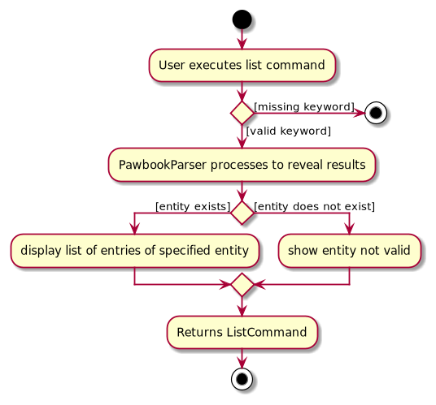 {: .center-image}

Below is an example sequence diagram for a valid find command from the user.

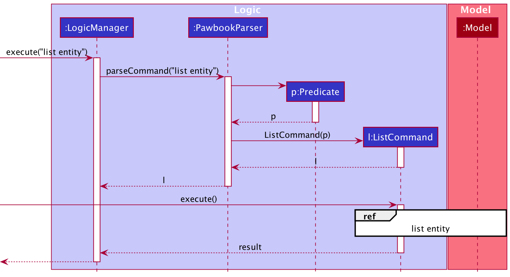 {: .center-image}
1. The `LogicManager` uses the `PawbookParser` to parse the given user input.
1. In `PawbookParser`, a `Predicate` is created based on which entity keyword was given by the user. There are only 3 cases here,
`owner`, `dog`, or `program`.
1. A `ListCommand` object will be created based on the `Predicate`.
1. The `LogicManager` will then proceed to call the `execute()` method.
1. The `execute()` method is further explored below. The high level understanding is that a CommandResult is returned and finally passed back to `LogicManager`.

Here is a more specific breakdown of the command's execute method.

 {: .center-image}
1. Upon calling the `execute()` method, the `ListCommand` updates the filtered entity list in `Model` using a `predicate` and an `entityType` as parameters. 
2. It then sorts the entity using the `sortEntities()` in increasing order by using a `COMPARATOR_ID_ASCENDING_ORDER` comparator that orders entities in increasing ID order. 
3. From here, List Command creates a command result and returns it to the `LogicManager`.

### View feature

Pawbook allows the user to `view` an entity and all its related entities. For instance, the user may want to `view` all the dogs of one particular owner or all the dogs enrolled in a program. By entering the correct view command with the correct identification number, the entire list will be generated.

When the user enters a valid command with the target entity ID, the ViewCommandParser will firstly parse the command and store the ID as an integer that is then passed on to as a parameter into the constructor method of a new ViewCommand instance.

Subsequently, once the new `ViewCommand` instance has been created, in its execute method, it will retrieve the entity via the ID that was passed in, from the `ModelManager`. With a handle on the target entity now, we build a list consisting of the entity IDs that are to be shown as search results.

Based on the class type of the target entity, we will reveal the search results accordingly. If the target entity is a `Dog`, then we will show the relevant owner profile. If the target entity is a `Owner`, then we will list out all of the owner's dogs. Similar to owner, for `Program`, we will reveal the full list of dogs enrolled in that program.

This list is subsequently passed on to the `RelatedEntityPredicate` that will later be used in the ModelManager's `updatefilteredEntityList())` method to finally reveal the search results.

Take note that this is the order in which results will be displayed, based on target entity searched:
* **View Dog**: Dog > Owner > Programs enrolled in
* **View Owner**: Owner > Dogs owned 
* **View Program**: Program > Dogs enrolled

Below is an example activity diagram for a valid view command from the user.

{: .center-image}

Below is an example sequence diagram for a valid view command from the user.

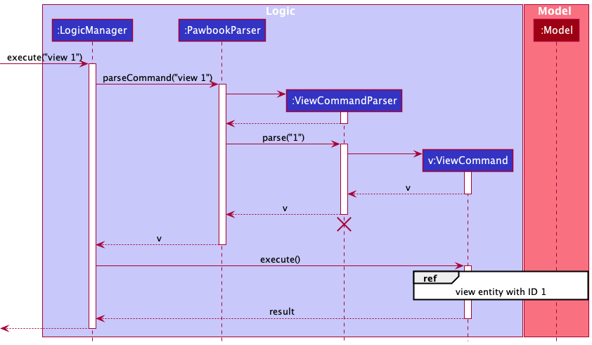{: .center-image}

1. The `LogicManager` uses the `PawbookParser` to parse the given user input. 
2. The `PawbookParser` identifies the user command and creates a `ViewCommandParser` object. It then calls the `ViewCommandParser`'s `parse()`method with user input as the parameter. 
3. In the `parse()` method, the `ViewCommandParser` will then generate the `ViewCommand` object. This is then returned all the way back to the `LogicManager`. 
4. The `LogicManager` will then proceed to call the `execute()` method. 
5. The `execute()` method is further explored below. The high level understanding is that a CommandResult is returned and finally passed back to `LogicManager`.

Here is a more specific breakdown of the command's execute method.

{: .center-image}

1. In the execute method of `ViewCommand`, it first generates a list of related entity IDs by calling the `generateRelatedIdList()`which accesses the data in the model. 
2. This list is then passed into the constructor method of `IdMatchPredicate` and is then passed into `updateFilteredEntityList()` method. The `updateFilteredEntityList()` updates the filtered entity list in model. 
3. Next, `ViewCommand` creates a `ViewCommandComparator` and uses it to sort the ordering of the filtered entity list. 
4. From there, `ViewCommand` generates the `CommandResult` based on the filtered entity list. This portion is not shown here as it is trivial.

### Enrol feature

Pawbook supports the enrolling of specific dogs into specific programs.

In order to enrol a dog into a program, the raw input needs to be parsed first. It is required that the user provides 2 parameters, namely `dogId` and `programId`. These inputs have the prefix `/d` and `/p`, and is followed by an integer. Using this information, the arguments will be forwarded to the `EnrolCommandParser` from within `PawbookParser`, which converts the String input to int.

Below is an example activity diagram for a valid enrol command from the user.

{: .center-image}

Below is an example sequence diagram for a valid enrol command from the user.

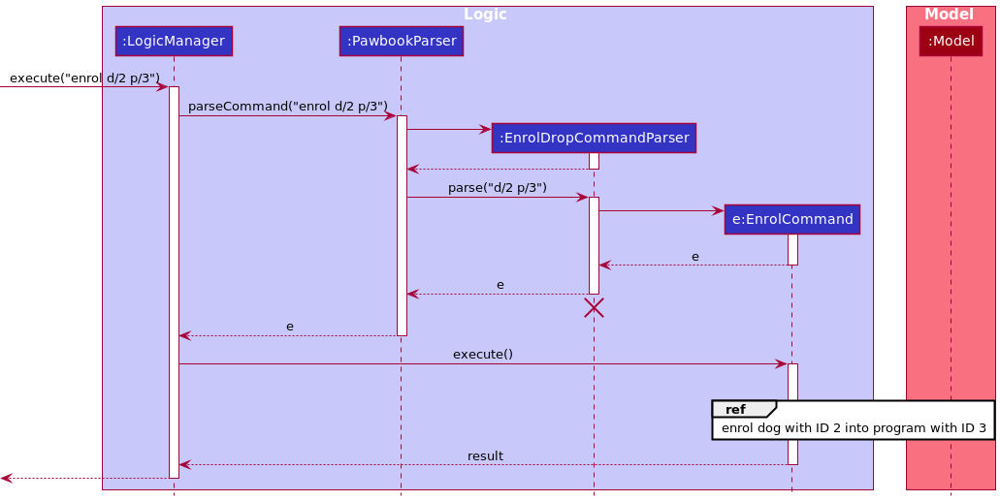{: .center-image}

1. The `LogicManager` uses the `PawbookParser` to parse the given user input.
1. The `PawbookParser` will identify the command given by the user based on the first command word and pass the user input down to `EnrolDropCommandParser`.
1. The `EnrolDropCommandParser` will then create an `enrolCommand` object with the user input `dogIdSet` and `programIdSet` as input parameters, in this case,
`dogIdSet` will be `[2]` and `programIdSet` will be `[3]`.
1. The `EnrolDropCommandParser` will then return an `enrolCommand` object.
1. The `LogicManager` will now call the `execute` method in the `enrolCommand` object.
1. The `EnrolCommand` will now call the `updateFilteredEntityList` method of the existing `Model` object.
1. The high level understanding is that a `CommandResult` is returned and finally passed back to `LogicManager`.

Here is a more specific breakdown of the command's execute method.

{: .center-image}

1. The `LogicManager` will call the execute method in the `EnrolCommand` object. 
1. The `EnrolCommand` will then call the `checkIdValidity` method of the existing `Model` object.
1. If the ID is valid, the `EnrolCommand` will create an `IdMatchPredicate` object.
1. The `EnrolCommand` will call the `updateFilteredEntityList` method of the existing `Model` object update the `IdMatchPredicate` object into Pawbook.
1. The `EnrolCommand` then creates a `CommandResult` object and returns it, indicating the successful updating of the `IdMatchPredicate` object.

### Drop feature

While Pawbook allows the enrolling of dogs into programs, conversely it supports dropping previously-enrolled dogs from the programs.

To drop a dog from a program, the raw input is parsed and goes through several checks to ensure that the provided dog and program IDs are both valid and are indeed referring to dog and program objects respectively. Subsequently, the arguments will be forwarded to `DropCommandParser` followed by `PawbookParser` where they are converted from the String input to int.

Below is an example activity diagram for a valid drop command from the user.

{: .center-image}

Below is an example sequence diagram for a valid drop command from the user.

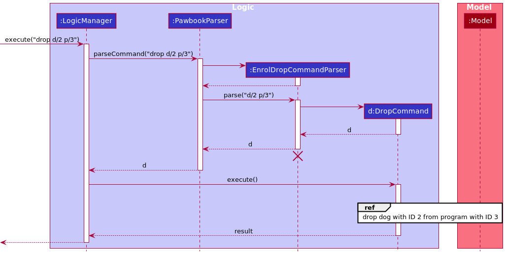{: .center-image}

1. The `LogicManager` uses the `PawbookParser` to parse the given user input.
1. The `PawbookParser` will identify the command given by the user based on the first command word and pass the user input down to `EnrolDropCommandParser`.
1. The `EnrolDropCommandParser` will then create a `dropCommand` object with the user input `dogIdSet` and `programIdSet` as input parameters, in this case,
`dogIdSet` will be [2] and `programIdSet` will be [3].
1. The `EnrolDropCommandParser` will then return a `enrolCommand` object.
1. The `LogicManager` will now call the execute method in the `dropCommand` object.
1. The `DropCommand` will now call the `updateFilteredEntityList` method of the existing `Model` object.
1. The high level understanding is that a `CommandResult` is returned and finally passed back to `LogicManager`.

Here is a more specific breakdown of the command's `execute` method.

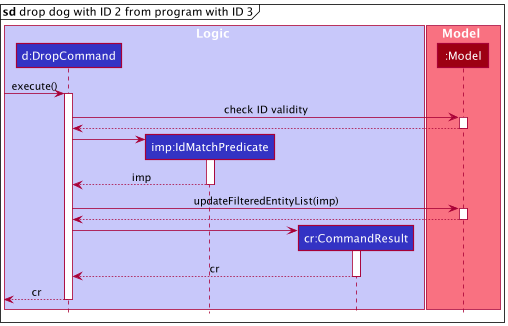{: .center-image}

1. The `LogicManager` will call the execute method in the `DropCommand` object. 
1. The `DropCommand` will then call the `checkIdValidity` method of the existing `Model` object.
1. If the ID is valid, the `DropCommand` will create an `IdMatchPredicate` object.
1. The `DropCommand` will call the `updateFilteredEntityList` method of the existing `Model` object update the `IdMatchPredicate` object into Pawbook.
1. The `DropCommand` then creates a `CommandResult` object and returns it, indicating the successful updating of the `IdMatchPredicate` object. 

### Alternate implementations

As dogs and programs can also be identified by their respective names instead of IDs, another implementation could be replacing the parameters of `dogId` and `programId` with their respective names.

However, this requires there to be no duplicate dog or program names.

--------------------------------------------------------------------------------------------------------------------

## **Documentation, logging, testing, configuration, dev-ops**

* [Documentation guide](Documentation.md)
* [Testing guide](Testing.md)
* [Logging guide](Logging.md)
* [Configuration guide](Configuration.md)
* [DevOps guide](DevOps.md)

--------------------------------------------------------------------------------------------------------------------

## **Appendix: Requirements**

### Product Scope

**Target user profile**:

* Has a need to manage a significant number of dogs and owners
* Prefers desktop apps over other types
* Is a fast typist
* Prefers typing to mouse interactions
* Is reasonably comfortable using CLI apps
* Prefers a portable and lightweight application

**Value proposition**:

* Manages contacts faster than a typical mouse/GUI driven app
* Saves significant time for the business owner, who beforehand had to manage the details of dogs and owners
* Consolidates information on dogs, owners and programs into one place
* Clutter-free user interface
* Application is optimised for keyboard navigation 

### User Stories

Priorities: High (must have) - `* * *`, Medium (nice to have) - `* *`, Low (unlikely to have) - `*`

| Priority | As a …​           | I want to …​                                                            | So that I can…​                    |
| -------- | -------------------- | -------------------------------------------------------------------------- | ---------------------------------------------------------------------- |
| `* * *`  | Dog school manager   | Have a list of dogs, owners, and programs in the school                    | Keep track of the operations and dogs we are responsible for     |
| `* * *`  | Dog school manager   | Easily switch between the different lists for dogs, owners and programs    | Quickly view all the profiles of one entity type     |
| `* * *`  | Dog school manager   | Add dog/owner/program profiles                                             | Keep track of the operations and parties involved in the school|
| `* * *`  | Dog school manager   | Delete dog/owner/program profiles                                          | Keep track of the operations and parties involved in the school|
| `* * *`  | Dog school manager   | Edit a dog/owner/program profile                                           | Correct/update a profile when it is incorrect.|
| `* * *`  | Dog school manager   | View a dog/owner/program profile                                           | Easily find out information on the target party|
| `* * *`  | Dog school manager   | Find profiles using keywords instead of ID                                 | Easily find a target dog/owner/program very quickly |
| `* * *`  | Dog school manager   | Enrol dogs into a specific dog program                                     | Dogs who recently joined a program are added to the class list |
| `* *`    | Dog school manager   | Drop dogs out of a specific dog program                                    | Dogs that have left the class are no longer in the class list  |
| `* * *`  | Dog school manager   | See the schedule for any day                                               | Easily view my schedule to know what programs are happening on that day |
| `* *`    | Dog school manager   | Autosave the data after every command                                      | Regularly save the data and protect sensitive data in the event that the system crashes |
| `* *`    | Advanced user        | Edit in bulk quickly                                                       | Save time and effort when making changes to multiple profiles |
| `* *`    | Beginner user        | Have a help command with a command summary available                       | Refer to it when I am unsure of the command |
| `* `     | User                 | Exit the application                                                       |           |

*{More to be added}*

### Use cases

(For all use cases below, the **System** is `Pawbook` and the **Actor** is the `user`, unless specified otherwise)

**Use case: UC01 - Add a dog/owner profile or program**

**MSS**

1.  User requests to add a dog/owner profile or program to the list.
2.  Pawbook adds the dog/owner.

    Use case ends.

**Extensions**

* 1a. Missing mandatory dog/owner/program details.

    * 1a1. Pawbook shows an error message.
    * 1a2. User supplies missing details.  
      Steps 1a1-1a2 are repeated until the command entered is correct.
      
    Use case resumes at step 2.
  
* 1b. Entity already exists in the program. 
  
    * 1b1. Pawbook shows an error message. 
    * 1b2. User supplies an entity with different details.  
      Steps 1b1-1b2 are repeated until the command entered is correct.
      
*Note:* The mandatory details here refer to name, breed, owner ID for dogs; name, phone number, email and address for owners; name and time for programs.

**Use case: UC02 - Delete a dog/owner profile or program**

**MSS**

1.  User requests to delete a specific dog/owner profile or program in the list.
2.  Pawbook deletes the dog/owner profile or program.

    Use case ends.

**Extensions**

* 1a. The given dog/owner/program ID is invalid or not specified.

    * 1a1. Pawbook shows an error message.
    * 1a2. User supplies the corrected dog/owner/program ID. 
      Steps 1a1-1a2 are repeated until the command entered is correct.

      Use case resumes at step 2.

**Use case: UC03 - Edit a dog/owner profile or program**

**MSS**

1.  User requests to edit a specific dog/owner/program in the list.
2.  Pawbook edits the dog/owner/program.

    Use case ends.

**Extensions**

* 1a. The given dog/owner/program ID is invalid or does not correspond to the entity specified. 

    * 1a1. Pawbook shows an error message.
    * 1a2. User supplies the corrected dog/owner/program ID. 
      Steps 1a1-1a2 are repeated until the command entered is correct.

      Use case resumes at step 2.
    
* 1a. The user failed to provide any mandatory details to be edited.

    * 1a1. Pawbook shows an error message.
    * 1a2. The user provides one or more mandatory details to be edited.
      Steps 1a1-1a2 are repeated until the command entered is correct.
    
      Use case resumes at step 2.

*Note:* The mandatory details here refer to name, breed, owner ID for dogs; name, phone number, email and address for owners; name and time for programs.

**Use case: UC04 - Show the specified entity list**

**MSS**

1.  User requests to list dog/owner/program.
2.  Pawbook lists the related dogs/owners/programs.

    Use case ends.

**Extensions**

* 1a. User requests to list something that is none of the three entities.

    * 1a1. Pawbook shows an error message.
    * 1a2. User supplies the corrected dog/owner/program parameter.  
      Steps 1a1-1a2 are repeated until the command entered is correct.

      Use case resumes at step 2.

**Use case UC05 - View an entity and all its related entities**

**MSS**

1. User types in view command with the target ID. 
2. Pawbook supplies the results matching the keyword(s).
3. Use case ends.

**Extensions**

* 1a. The ID is not provided.
  
    * 1a1. Pawbook shows an error message. 
    * 1a2. User supplies a valid ID. 
      Steps 1a1-1a2 are repeated until the command entered is correct.

      Use case resumes at step 2.

* 1b. The ID is invalid (negative, out of bounds, not in database etc.).
  
  * 1b1. Pawbook shows an error message. 
  * 1b2. User supplies a valid ID. 
    Steps 1b1-1b2 are repeated until the command entered is correct.
    
    Use case resumes at step 2.
    

**Use case UC06 - Find entity using keyword(s)**

**MSS**

1. User types in find command with one or more keywords.
2. Pawbook supplies the results matching the keyword(s).
3. Use case ends.

**Extensions**

* 1a. The keyword is not provided.

    * 1a1. Pawbook shows an error message and requests keyword.
    * 1a2. User supplies keywords. 
      Steps 1a1-1a2 are repeated until the command entered is correct.

    Use case resumes at step 2.

**Use case: UC07 - Enrol dog to a program**

**MSS**

1.  User requests to enrol dog to program.
2.  Pawbook enrols the dog to the correct program.

    Use case ends.

**Extensions**

* 1a. The dog/program ID is invalid/not specified.

    * 1a1. Pawbook shows an error message.
    * 1a2. User supplies correct dog/program ID. 
      Steps 1a1-1a2 are repeated until the command entered is correct.

      Use case resumes at step 2.
    
* 1b. The user requests to enrol multiple dogs to multiple programs.

    * 1b1. Pawbook shows an error message.
    * 1b2. User changes request to either enrolling one dog to one program, one dog to multiple programs, or multiple dogs to one program.
      Steps 1b1-1b2 are repeated until the command entered is correct.
      
    Use case resumes at step 2.

**Use case: UC08 - Drop dog from program**

**MSS**

1.  User requests to drop dog from program.
2.  Pawbook drops dog from the correct program.

    Use case ends.

**Extensions**

* 1a. The dog/program ID is invalid/not specified.

    * 1a1. Pawbook shows an error message.
    * 1a2. User supplies correct dog/program ID. 
      Steps 1a1-1a2 are repeated until the command entered is correct.

      Use case resumes at step 2.
    
* 1b. The user requests to drop multiple dogs from multiple programs.

    * 1b1. Pawbook shows an error message.
    * 1b2. User changes request to either dropping one dog from one program, one dog from multiple programs, or multiple dogs from one program.
      Steps 1b1-1b2 are repeated until the command entered is correct.
      
  Use case resumes at step 2.

**Use case: UC09 - View schedule**

**MSS**

1.  User requests to view schedule with a specified date. 
2.  Pawbook shows the schedule.

    Use case ends.

**Extensions**

* 1a. The date is invalid/not specified.

    * 1a1. Pawbook shows an error message.
    * 1a2. User supplies correct date.  
      Steps 1a1-1a2 are repeated until the command entered is correct.
      
    Use case resumes at step 2.

**Use case: UC10 - View Help Window**

**MSS**

1.  User enters `help` command into the command box and presses <kbd>enter</kbd>.   
2.  Pawbook opens a help window containing the link to the user guide
and also a command summary for the user.

    Use case ends.

**Extensions**

- 1a. The given command/format is invalid. 
    - 1a1. Pawbook shows an error message to the user.
    - 1a2. User supplies the correct command.  
      Steps 1a1-1a2 are repeated until the command entered is correct.
    Use case resumes at step 2.
      
**Use case: UC11 - Exit Pawbook**

**MSS**

1.  User enters the `exit` command into the command box and presses <kbd>enter</kbd>.    
2.  Pawbook shows goodbye message.
3.  Pawbook terminates.

    Use case ends.

**Extensions**

- 1a. The given command/format is invalid.
    - 1a1. Pawbook shows an error message to the user.
    - 1a2. User supplies the correct command.  
      Steps 1a1-1a2 are repeated until the command entered is correct.
      Use case resumes at step 2.

*{More to be added}*

### Non-Functional Requirements

1.  Should work on any [mainstream OS](#glossary-OS) as long as it has `Java 11` or above installed.
2.  Should be able to hold up to 100000 dogs, owners and dog programs without a noticeable sluggishness in performance for typical usage.
3.  Should be usable by a tech novice who is not familiar with CLI.
4.  Should respond within 2 seconds.
5.  A user with above average typing speed for regular English text (i.e. not code, not system admin commands)
    should be able to accomplish most of the tasks faster using commands than using the mouse.
6.  A simple interface that is easy to navigate.
7.  Not required to handle finance-related bookkeeping.
8.  Pawbook does not require internet connection to run. 
9.  Able to work in all different time zones, regardless of where the system is operated in the world. 
10. Features should be implemented such that they can undergo automated testing. 
11. Pawbook data should be saved locally. Not possible to be hacked from external machines. Only way to access is through the local machine.
12. Only one Pawbook program can run on a local machine at any time. 
13. Pawbook program file size should not exceed beyond 1GB. 
14. Pawbook should be able to recover from exceptions and error handling and not freeze on the user. 

### Glossary

* {: #glossary-OS} **Mainstream OS**: Windows, Linux, Unix, OS-X
* **JSON**: JSON is short for **JavaScript Object Notation** which is a lightweight format for data storage 

--------------------------------------------------------------------------------------------------------------------

## **Appendix: Instructions for manual testing**

Given below are instructions to test the app manually. These instructions should be complemented with the user
guide for comprehensive testing. The state of the application is assumed to contain the sample data from when the 
application is first launched.

:information_source: **Note:** These instructions only provide a starting point for testers to work on;
testers are expected to do more *exploratory* testing.

### Launch and shutdown

1. Initial launch

   1. Download the jar file and copy into an empty folder

   1. Double-click the jar file  
      Expected: Shows the GUI with a set of sample contacts. The window size may not be optimum.

1. Saving window preferences

   1. Resize the window to an optimum size. Move the window to a different location. Close the window.

   1. Re-launch the app by double-clicking the jar file. 
       Expected: The most recent window size and location is retained.

1. Exiting the app

    1. With the application still open, enter `exit` in the command box or click on the close window button [X]. 
       Expected: Application terminates.   
      
1. For the sake of all manual testing, we will be using the preset typical entities loaded from Pawbook database.
      
### Add Command 

1. Adding a dog

    1. Prerequisites: Pawbook is launched and running.

    1. Test case: `add dog n/Bruce b/Chihuahua d/12-02-2019 s/Male o/1 t/playful t/active`  
       Expected: If database does not already contain a Bruce, a successful command result should show.

    1. Test case: `add dog o/1 b/Chihuahua d/12-02-2019 n/Bruce s/Male t/playful t/active`  
       Expected: Similar to previous.

    1. Test case : `add dog o/1 b/Chihuahua d/12-02-2019 n/Bruce t/playful t/active`  
       Expected: Missing parameters, status message indicates invalid command format.

1. Adding an owner 

    1. Prerequisites: Pawbook is launched and running. 
    
    1. Test case: `add owner n/John Doe p/98765432 e/johnd@example.com a/311, Clementi Ave 2, #02-25 t/friends t/owesMoney`  
        Expected: If database does not already contain a John Doe, a successful command result should show. 
       
    1. Test case: `add owner n/John Doe a/311, Clementi Ave 2, #02-25 e/johnd@example.com p/98765432  t/friends t/owesMoney`  
        Expected: Similar to previous.
       
    1.  Test case : `add owner n/John Doe p/98765432 e/johnd@example.com a/311, Clementi Ave 2, #02-25 t/friends t/owesMoney`  
        Expected: Missing parameter, status message indicates invalid command format.
        
1. Adding a program 

    1. Prerequisites: Pawbook is launched and running.

    1. Test case: `add program n/Obedience Training s/01-02-2021 18:00 t/puppies`  
       Expected: If database does not already contain a Bruce, a successful command result should show.
       
    1. Test case: `add program s/01-02-2021 n/Obedience Training 18:00 t/puppies`  
       Expected: Similar to previous.

    1. Test case : `add program n/Obedience Training t/puppies`  
       Expected: Missing parameters, status message indicates invalid command format.
        
### Delete Command

1. Deleting an owner while all owners are being shown

    1. Prerequisites: List all owners using the `list owner` command. Multiple owners in the list.

    1. Test case: `delete owner 1` 
       Expected: Owner with ID 1 is deleted from the list. All the dogs belonging to the first owner is also deleted. 
       Details of the deleted contact shown in the status message. Timestamp in the status bar is updated. 

    1. Test case: `delete owner 0` 
       Expected: No owner is deleted. Error details shown in the status message. Status bar remains the same.
       
    1. Test case: `delete owner 2`  
       Expected: No owner is deleted as ID 2 is not an owner. Error details shown in the status message. Status bar remains the same.

    1. Other incorrect delete commands to try: `delete owner`, `delete owner x`, `delete owner -x` (where x is larger than list size or negative) 
       Expected: Similar to previous.
       
1. Deleting a dog while all dogs are being shown 

    1. Prerequisites: List all dogs using the `list dog` command. Multiple dogs in the list. 
    
    1. Test case: `delete dog 2`  
       Expected: Dog with ID 2 is deleted from the list. The dogs will also be removed from all programs they were previously
       enrolled in.

    1. Test case: `delete dog 0` 
      Expected: No dog is deleted. Error details shown in the status message. Status bar remains the same.

    1. Test case: `delete dog 1` 
      Expected: No owner is deleted as ID 1 is not a dog. Error details shown in the status message. Status bar remains the same.

    1. Other incorrect delete commands to try: `delete dog`, `delete dog x`, `delete dog -x` (where x is larger than list size or negative) 
      Expected: Similar to previous.

1. Deleting a program while all programs are being shown

    1. Prerequisites: List all programs using the `list program` command. Multiple programs in the list.

    1. Test case: `delete program 3` 
       Expected: Program with ID 3 is deleted from the list. The dogs that were enrolled in the program will no longer be enrolled in that program. 
       
    1. Test case: `delete program 0` 
       Expected: No program is deleted. Error details shown in the status message. Status bar remains the same.

    1. Test case: `delete program 1` 
       Expected: No owner is deleted as ID 1 is not a dog. Error details shown in the status message. Status bar remains the same.

    1. Other incorrect delete commands to try: `delete program`, `delete program x`, `delete program -x` (where x is larger than list size or negative) 
       Expected: Similar to previous.
       
### Edit Command

1. Pre-requisites

    1. Start with an empty database by deleting all entities.

    1. Add a sample owner with `add owner n/John Doe p/98765432 e/johnd@example.com a/311, Clementi Ave 2, #02-25 t/friends t/owesMoney`. Ensure John Doe has ID 1.

    1. Add a sample dog with `add dog n/Bruce b/Chihuahua d/12-02-2019 s/Male o/1 t/playful t/active`

    1. Add a sample program with `add program n/Obedience Training s/01-02-2021 18:00 t/puppies`
    
    1. Add another sample owner with `add owner n/James Bond p/90139122 e/jamesbond@example.com a/322, Clementi Ave 2, #02-25 t/friends t/owesMoney` Ensure James Bond has ID 4. 

1. Editing a dog

    1. Test case: `edit dog 2 n/Milo` 
       Expected: Successfully renamed Bruce to Milo. 
       
    1. Test case: `edit dog 2 n/Bruce o/4`
       Expected: Successfully renamed Milo to Bruce and changed owner from John Doe to James Bond. 
       
    1. Test case: `edit dog 3 n/Milo o/4`
       Expected: Error status message shown, indicating dog ID provided is invalid. 

1. Editing an owner 

    1. Test case: `edit owner 1 p/91234567`
       Expected: Successfully changes John Doe's number. 

    1. Test case: `edit owner 1 p/97538642 e/ilovedogs@sample.com`
       Expected: Successfully changed John Doe's number and updated his email.

    1. Test case: `edit owner 3 n/Keith`
       Expected: Error status message shown, indicating owner ID provided is invalid.

1. Editing a program 

    1. Test case: `edit program 3 n/Kennel Training`
       Expected: Successfully renamed Obedience Training to Kennel Training. 

    1. Test case: `edit program 3 n/Kennel Training s/01-02-2021 17:00`
       Expected: Successfully renamed Obedience Training to Kennel Training and changes the session date to 1700 from 1800. 

    1. Test case: `edit program 4 n/Kennel Training s/01-02-2021 17:00`
       Expected: Error status message shown, indicating program ID provided is invalid.

### Find Command 

1. Find valid entities

    1. Prerequisites: Application is running. List being shown does not matter. 

    1. Test case: `Find Carl` 
       Expected: Carl with ID 5 is shown on the display list. Status message says "1 entity listed!"

    1. Test case: `Find Car` 
       Expected: Similar to previous. 

    1. Test case: `Find Car` 
       Expected: Similar to previous. 

    1. Test case: `find carl` 
       Expected: Similar to previous  
       
    1. Test case: `find Elsa Flora Genie`  
       Expected: Else, Flora and Genie are displayed on the list. Status messages says: "3 entities listed!"
       
1. Finding invalid entities

    1. Test case: `find InvalidName` 
       Expected: Zero entities listed. 
       
    1. Test case: `find 12345`  
       Expected: Zero entities listed. 
       
### List Command

1. Listing dogs 

    1. Test case: `list dog` 
       Expected: All the dogs in the school listed. 

1. Listing owners

    1. Test case: `list owner` 
       Expected: All the owners in the school listed.

1. Listing program

    1. Test case: `list program` 
       Expected: All the programs in the school listed.

1. Invalid List commands

    1. Test case: `list`  
       Expected: Error message indicates unknown entity, shows supported entities.
       
    1. Test case: `list invalidEntity`  
       Expected: Similar to previous. 
       
### View Command 

1. Pre-requisites

    1. Start with an empty database by deleting all entities. 
    
    1. Add a sample owner with `add owner n/John Doe p/98765432 e/johnd@example.com a/311, Clementi Ave 2, #02-25 t/friends t/owesMoney`. Ensure John Doe has ID 1. 
    
    1. Add a sample dog with `add dog n/Bruce b/Chihuahua d/12-02-2019 s/Male o/1 t/playful t/active`

    1. Add a sample program with `add program n/Obedience Training s/01-02-2021 18:00 t/puppies`
    
    1. Enrol Bruce into Obedience Training with `enrol d/2 p/3`
    
    1. Ensure that Bruce is successfully added to the Obedience Training program. 
    
1. Viewing owner 

    1. Test case: `view 1`
       Expected: John's and Bruce's contacts are listed. John Doe's contact is at the top, followed by Bruce.
       
1. Viewing dog 
    
    1. Test case: `view 2`
       Expected: John, Bruce and Obedience Training program is listed. Bruce's contact is at the top, followed by John, 
        followed by Obedience Training. 

1. Viewing program

    1. Test case: `view 3`
       Expected: Bruce and Obedience Training program is listed. Obedience training details are at the top, followed by Bruce's details. 
       
1. Invalid view ID 

    1. Test case: `view 4`
       Expected: Error status message is provided, indicating invalid ID. 
       
    1. Test case: 'view -1'
       Expected: Similar to previous. 

### Schedule Command 

1. Pre-requisites 

    1. Start with an empty database by deleting all entities. 

    1. Add a sample program with `add program n/Obedience Training 1 s/[TODAY'S DATE] 18:00 t/puppies`. Fill in today's
      date in the `[TODAY'S DATE]` field.

    1. Add a sample program with `add program n/Obedience Training 2 s/01-02-2021 18:00 t/puppies`
    
    1. Ensure that sample programs are successfully added. 

1. Viewing schedules on a valid day 

    1. Test case: `schedule`  
       Expected: Successful status message, shows the sample Obedience Training 1 happening today.

    1. Test case: `schedule 01-02-2021`  
       Expected: Successful status message, shows the sample Obedience Training 1 happening on 01-02-2021. 
       
    
1. Viewing schedules on an invalid day 

    1. Test case: `schedule 31-02-2021`
       Expected: Error status message thrown, indicating day of the month does not exist.
       
    1. Test case: `schedule 031-02-2021`
       Expected: Error status message thrown, indicating that date format should be in dd-MM-yyyy format. 
       
### Enrol Command 

1. Pre-requisites

    1. Start with an empty database by deleting all entities.

    1. Add a sample owner with `add owner n/John Doe p/98765432 e/johnd@example.com a/311, Clementi Ave 2, #02-25 t/friends t/owesMoney`. Ensure John Doe has ID 1.

    1. Add a sample dog with `add dog n/Bruce b/Chihuahua d/12-02-2019 s/Male o/1 t/playful t/active` Ensure Bruce has ID 2.

    1. Add a sample program with `add program n/Obedience Training s/01-02-2021 18:00 t/puppies` Ensure Obedience Training has ID 3.
    
1. Enrol valid dog into valid program 

    1. Test case: `enrol d/2 p/3`  
       Expected: Bruce is successfully added to the Obedience Training program.
       
1. Enrol valid dog into invalid program 

    1. Test case: `enrol d/2 p/4`  
       Expected: Error status message stating program ID is invalid.  

1. Enrol invalid dog into valid program 

    1. Test case:  `enrol d/3 p/3`  
       Expected: Error status message stating dog ID is invalid.
       
1. Enrol multiple valid dogs into valid program

    1. Repeat Pre-requisites
    
    1. Add another sample dog with `add dog n/Apple b/Golden Retriever d/28-04-2020 s/Female o/1 t/friendly` Ensure Apple as ID 4.
    
    1. Test case: `enrol d/2 d/4 p/3`  
        Expected: Bruce and Apple are successfully added to the Obedience Training program.
        
1. Enrol one valid dog into multiple valid programs

    1. Repeat Pre-requisites
    
    1. Add another sample program with `add program n/Potty Training s/14-03-2021 12:00 t/puppies` Ensure Potty Training has ID 4.
    
    1. Test case: `enrol d/2 p/3 p/4`  
        Expected: Bruce is successfully added to the Obedience Training program and the Potty Training program.
        
1. Enrol multiple valid dogs into multiple valid programs
    
    1. Repeat Pre-requisites
    
    1. Add another sample dog with `add dog n/Apple b/Golden Retriever d/28-04-2020 s/Female o/1 t/friendly` Ensure Apple has ID 4.
    
    1. Add another sample program with `add program n/Potty Training s/14-03-2021 12:00 t/puppies` Ensure Potty Training has ID 5.
        
    1. Test case: `enrol d/2 d/4 p/3 p/5 `  
        Expected: Error messaging stating that enrollment of multiple dogs into multiple programs is not supported.
       
1. Invalid enrol command 

    1. Test case: `enrol invalidCommand`
       Expected: Error status message indicating wrong command format.  

### Drop Command 

1. Pre-requisites

    1. Start with an empty database by deleting all entities.

    1. Add a sample owner with `add owner n/John Doe p/98765432 e/johnd@example.com a/311, Clementi Ave 2, #02-25 t/friends t/owesMoney`. Ensure John Doe has ID 1.

    1. Add a sample dog with `add dog n/Bruce b/Chihuahua d/12-02-2019 s/Male o/1 t/playful t/active`. Ensure Bruce has ID 2.

    1. Add a sample program with `add program n/Obedience Training s/01-02-2021 18:00 t/puppies` Ensure Obedience Training has ID 3.

1. Drop valid dog from valid program

    1. Enrol dog into program with: `enrol d/2 p/3`
    
    1. Test case: `drop d/2 p/3`  
       Expected: Bruce is successfully dropped from Obedience Training program.

1. Drop valid dog from invalid program

    1. Enrol dog into program with: `enrol d/2 p/3`
    
    1. Test case: `drop d/2 p/4`  
       Expected: Error status message stating program ID is invalid.

1. Drop invalid dog from valid program

    1. Enrol dog into program with: `enrol d/2 p/3`

    1. Test case:  `drop d/3 p/3`  
       Expected: Error status message stating dog ID is invalid.
       
1. Drop multiple valid dogs from valid program

    1. Repeat Pre-requisites
    
    1. Add another sample dog with `add dog n/Apple b/Golden Retriever d/28-04-2020 s/Female o/1 t/friendly` Ensure Apple as ID 4.
    
    1. Enrol dogs into program with: `enrol d/2 d/4 p/3`
    
    1. Test case: `drop d/2 d/4 p/3`  
       Expected: Bruce and Apple are successfully added to the Obedience Training program.
        
1. Drop one valid dog from multiple valid programs

    1. Repeat Pre-requisites
    
    1. Add another sample program with `add program n/Potty Training s/14-03-2021 12:00 t/puppies` Ensure Potty Training has ID 4.
    
    1. Enrol dog into programs with: `enrol d/2 p/3 p/4`
    
    1. Test case: `drop d/2 p/3 p/4`  
       Expected: Bruce is successfully added to the Obedience Training program and the Potty Training program.
        
1. Drop multiple valid dogs from multiple valid programs
    
    1. Repeat Pre-requisites
    
    1. Add another sample dog with `add dog n/Apple b/Golden Retriever d/28-04-2020 s/Female o/1 t/friendly` Ensure Apple has ID 4.
    
    1. Add another sample program with `add program n/Potty Training s/14-03-2021 12:00 t/puppies` Ensure Potty Training has ID 5.
        
    1. Enrol dog into program with: `enrol d/2 p/3` and `enrol d/4 p/5`
    
    1. Test case: `drop d/2 d/4 p/3 p/5 `  
        Expected: Error messaging stating that droplment of multiple dogs from multiple programs is not supported.

1. Invalid drop command

    1. Test case: `drop invalidCommand`
       Expected: Error status message indicating wrong command format.
       
### Help Command

1. Test case: `help` 
   Opens a pop-up window that shows the command summary and

### Exit Command

1. Test case: `exit` 
   Expected: The program should exit and close.

### Saving data

1. Dealing with missing/corrupted data files

   1. _{explain how to simulate a missing/corrupted file, and the expected behavior}_

1. _{ more test cases …​ }_
